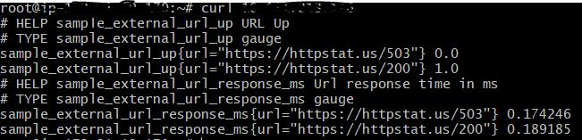
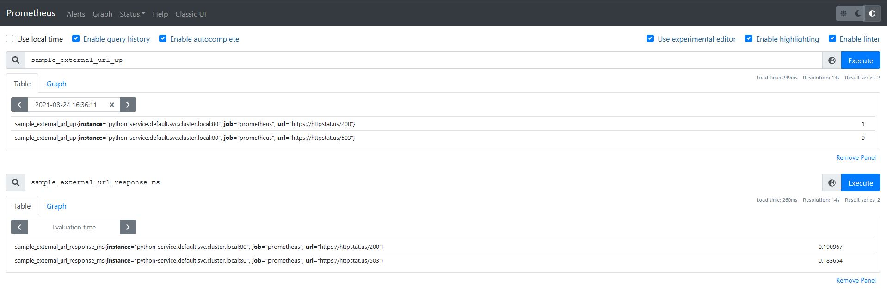
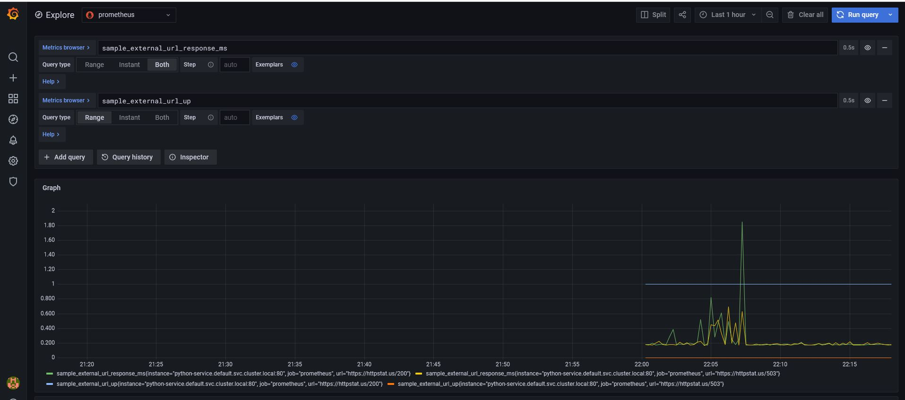

# Demo Prometheus Metric Monitoring using python service 

This is a URL availability check using python service, can be deployed on Kubernetes Cluster.

This Demo Python service access 2 URLs mentioned below, check if the URLs are up and get respective response times of the URL.

### URL 
* https://httpstat.us/503
* https://httpstat.us/200
### Metrics
* sample_external_url_up
* sample_external_url_response_ms 

Status code from URL response states the availability of the URL/Application. A response of status code 200, states the application is up and running. A response of status code 200, states the application is not available.

Refer to  [HTTP Status codes](https://httpstat.us/)    

## Requirements
This service is developed in Python 3.9-alpine. 

The following packages will be installed as part of image:
* requests
* prometheus_client


## Docker File  and Docker Image
```
FROM python:3.9-alpine
RUN pip install requests
RUN pip install prometheus-client
EXPOSE 80
ADD promtest.py /
WORKDIR /
ENTRYPOINT ["python"]
CMD ["/promtest.py"]
```
Docker Image is based on python:3.9-alpine. 

HTTP Port 80 is exposed for the service. 

python is ENTRYPOINT to the docker image and executes promtest.py python code to render URL response time and status codes in prometheus format. 
Below is the sample response format 
```
# HELP sample_external_url_up URL Up
# TYPE sample_external_url_up gauge
sample_external_url_up{url="https://httpstat.us/503"} 0.0
sample_external_url_up{url="https://httpstat.us/200"} 1.0
# HELP sample_external_url_response_ms Url response time in ms
# TYPE sample_external_url_response_ms gauge
sample_external_url_response_ms{url="https://httpstat.us/503"} 0.195786
sample_external_url_response_ms{url="https://httpstat.us/200"} 0.176795
``` 
This service is available as a docker image: [asuprabhat/python_prometheus_metrics](https://hub.docker.com/r/asuprabhat/python_prometheus_metrics)

Docker pull command:
```
docker pull asuprabhat/python_prometheus_metrics
```

To run the docker image on local computer, use the following command
```
docker run -dit -p 8080:80 qiuosier/prometheus_metrics
```
This command maps the service to port 8080 on `localhost`. Once the docker image is running, the metrics will be available at http://localhost:8080

## Kubernetes Deployment Specifications
Python service is deployed using **deployment.yaml** file, which contains deployment specifications. Python Service is exposed as ClusterIP Kubernetes Service *python-service*
 
Below command deploys python service to Kubernetes cluster 
```
kubectl apply -f deployment.yaml
```

This service can be accessed on kubernetes cluster by accessing python-service CLUSTERIP endpoint `/metrics`, e.g. curl http://CLUSTERIP/metrics

Below figure shows the output of the service 


#### Prometheus Server deployment 

Prometheus Server is deployed using `prometheus-deploy.yaml` file. Prometheus is exposed as NodePort Kubernetes Service *prometheus-service*
Below command deploys prometheus service to Kubernetes cluster 
```
kubectl apply -f prometheus-deploy.yaml
```

#### Grafana deployment 

Grafana is deployed using `grafana-deploy.yaml` file. Grafana is exposed as NodePort Kubernetes Service *grafana*
Below command deploys grafana service to Kubernetes cluster 
```
kubectl apply -f grafana-deploy.yaml
```

The following figure shows a simple query on the Prometheus server:


The following figure visualizes the metrics in Grafana:

